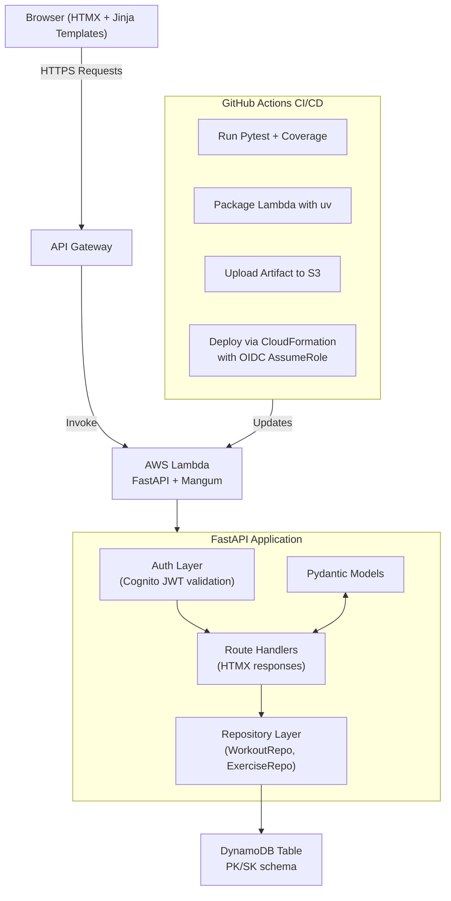

# ElbieFit

ElbieFit is a portfolio project — a lightweight workout-logging web application built with FastAPI, HTMX, and a production-grade AWS serverless architecture.

The application is designed to run on AWS (Lambda + DynamoDB + Cognito) and the full infrastructure configuration is included in `infra/` to demonstrate real-world deployment patterns. For simplicity and cost reasons, it is typically run locally using uvicorn and DynamoDB Local.

The goal is to provide a simple, fast, modern interface that allows users to log workouts, track progress, and manage profiles — backed by clean architecture and test-focused development.

## Features

- Log workouts with dates, names, tags, and notes
- Track sets with reps, weight, and RPE (Rate of Perceived Exertion)
- Metric and imperial unit support
- Customisable themes
- Cognito authentication with JWT session cookies

## Architecture

The diagram below shows the intended AWS deployment architecture. The full infrastructure configuration lives in `infra/` as CloudFormation stacks. Locally, the browser talks directly to uvicorn and DynamoDB Local replaces the managed DynamoDB service.



## Tech stack

| Layer | Technology |
|---|---|
| Runtime | Python 3.12 |
| Framework | FastAPI + Mangum (Lambda adapter) |
| Database | DynamoDB (single-table design) / DynamoDB Local for local dev |
| Auth | AWS Cognito + JWT (bypassed in local dev) |
| Frontend | Jinja2 SSR + HTMX + custom CSS |
| Infrastructure | AWS Lambda, API Gateway v2, CloudFormation |
| Package manager | uv |
| Tests | pytest, pytest-asyncio, pytest-cov |
| Linting | ruff + black |

## Local development

### Prerequisites

- Python 3.12
- [uv](https://docs.astral.sh/uv/)
- Docker + Docker Compose

### 1. Install dependencies

```bash
uv sync
```

### 2. Start DynamoDB Local

```bash
docker compose up -d
```

This starts DynamoDB Local on port `8001`. Data is persisted to a Docker volume so it survives container restarts.

### 3. Create the local table

Only needed the first time (or after wiping the volume):

```bash
uv run python -m scripts.create_local_table
```

### 4. Seed data

```bash
uv run python -m scripts.seed --display-name "Your Name" --email "you@example.com"
```

To wipe and re-seed:

```bash
uv run python -m scripts.seed --display-name "Your Name" --email "you@example.com" --reset
```

### 5. Run the app

```bash
uv run uvicorn app.main:app --reload
# or, to capture logs:
uvicorn app.main:app 2>&1 | tee app.log
```

Open [http://localhost:8000](http://localhost:8000).

Auth is disabled in local dev (`DISABLE_AUTH_FOR_LOCAL_DEV=True` in `.env.dev`), so you'll be logged in automatically as the dev user defined by `DEV_USER_SUB`.

---

## Running tests

```bash
uv run pytest
```

Coverage is enforced at 70% minimum. The full report is written to `htmlcov/`.

## Linting

```bash
uv run ruff check .
uv run black --check .
```

---

## Project structure

```
app/
  main.py               FastAPI app init (routers, middleware, error handlers)
  handler.py            Lambda entry point (Mangum adapter)
  settings.py           Config (loaded from .env.{ENV})
  routes/               Route handlers (home, auth, profile, workout, exercise)
  repositories/         Data access layer (DynamoDB implementations)
  models/               Pydantic models
  middleware/           Rate limiting, theme injection
  utils/                Auth, DB helpers, dates, units, logging
  templates/            Jinja2 HTML templates

tests/
  unit/                 Route, repo, model, middleware, and util tests

infra/
  app.yaml              Lambda + API Gateway CloudFormation stack
  cognito.yaml          Cognito user pool stack
  data.yaml             DynamoDB table stack
  iam.yaml              IAM roles stack
  s3.yaml               S3 artifact bucket stack

scripts/
  create_local_table.py Create DynamoDB table in DynamoDB Local
  seed.py               Populate demo data
  deploy_stack.sh       Deploy a CloudFormation stack
  deploy_code.sh        Package and upload Lambda code
  update_lambda_code.sh Update Lambda code from S3 artifact
```

---

## Deployment

The `infra/` directory contains CloudFormation stacks for the full AWS deployment (Lambda, API Gateway, DynamoDB, Cognito, IAM, S3). These exist to demonstrate production infrastructure patterns, not as an actively maintained deployment.

The CI/CD pipeline in `.github/workflows/` packages and deploys the Lambda via GitHub Actions with OIDC (no long-lived keys). The app can be deployed to AWS with the provided scripts:

```bash
# Deploy infrastructure (first time or after infra changes)
./scripts/deploy_stack.sh dev

# Deploy application code only
./scripts/deploy_code.sh dev
./scripts/update_lambda_code.sh dev
```
